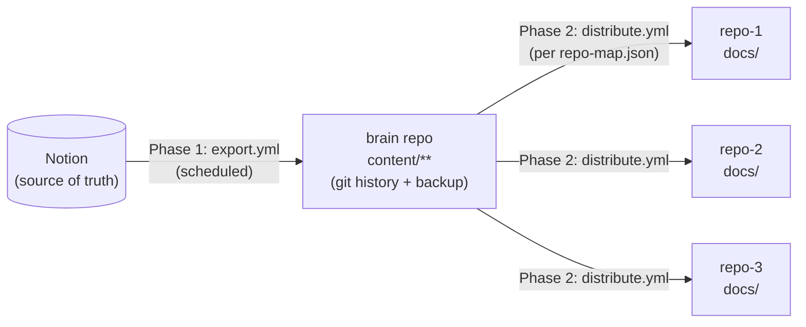

# Notion → git → brain → project repos: a documentation sync pipeline

A template for a one-way documentation pipeline: Notion stays your source of
truth, a scheduled GitHub Action exports it to a central git repo ("brain"),
and a second Action distributes the relevant slices of that repo into each
of your project repos' `docs/` folders — so a Claude Code session started in
any of those repos has current reference material without anyone copying
and pasting it there by hand.

This is a generalized version of a pipeline built and run in production for
one real workspace. The scripts and workflows here are the actual working
code, with real repo names, Notion page IDs, and secret names replaced by
placeholders you fill in for your own setup.

## 1. What problem this solves

If you use Claude (web or desktop) to plan and brainstorm — research,
PRDs, architecture notes, roadmaps — and then hand the actual build off to
Claude Code, keeping those two in sync is the part that breaks. Notion is a
natural place to think and write with Claude: it's where a brainstorming
session lands, where a PRD gets drafted and revised over several
conversations, where research gets captured as it comes in. But Claude
Code works from files in a repo, not from a Notion workspace, so without
something bridging the two, either someone copies content over by hand
(and it goes stale the moment either side changes again) or every Claude
Code session just starts from zero context on what was actually decided.

This pipeline closes that loop. Brainstorm and plan with Claude in Notion,
push it there as the source of truth, and by the time you open Claude Code
to build, it already has the full, current context — faster ideation to
deployment, with no manual copy-paste step in between.

**It also keeps things in sync across all of your repos, not just one.**
A single Notion workspace can hold planning material for many projects at
once. This pipeline exports that whole tree into one central git repo, and
a second stage then distributes each project's relevant slice out to that
project's own repo (via `config/repo-map.json` — see Architecture below).
So a PRD update in Notion doesn't just update one place; it flows out to
every repo mapped to it, automatically, on the same schedule.

**Notion is always the source of truth, however you edit it.** Whether you
update a page by asking Claude to change it, or you edit it directly and
manually in Notion's own UI, it makes no difference to the sync — either
way, the next scheduled run reads whatever's currently in Notion and
propagates it out. The one rule that has to hold is the direction: changes
flow Notion → git, never the other way. Edit `docs/` in a project repo by
hand and the next sync silently overwrites it, since Notion, not git, is
what this pipeline treats as ground truth. Two-way sync was considered and
rejected for exactly this reason — it creates conflicts, and conflict
resolution is exactly the maintenance burden this pipeline exists to
eliminate.

## 2. Architecture overview

Two independent phases, each its own GitHub Action, each fully functional
on its own before the next is layered on.



### Phase 1: Notion → brain repo

`export.yml` runs on a schedule (nightly by default), authenticates to the
Notion API, walks the page tree under a configured root page, converts each
page to markdown, and writes it under `content/` in the brain repo —
mirroring the Notion hierarchy as nested folders. It commits and pushes only
if something actually changed (`git status --porcelain`), so a quiet night
in Notion produces no commit.

Every generated file gets a header:

```
<!--
  Source: https://www.notion.so/...
  This file is generated from Notion. Do not edit directly - it will be overwritten.
-->
```

This isn't decoration. `content/` is fully rebuilt from scratch on every
run (`export.js` wipes and recreates the directory), so **any hand edit
made directly to a file under `content/` is silently gone on the next
sync** — no error, no warning, just gone. The header is the only thing
telling a future reader (human or Claude) that a file is generated and
where the real content lives.

### Phase 2: brain repo → project repos' `docs/`

`distribute.yml` reads `config/repo-map.json` — a version-controlled config
that says, for each path under `content/`, which target repo(s) it goes to
and under what destination path. For each mapped file, `distribute.js`
diffs it against what's currently on the target repo's `main` branch and,
if different, writes it — either:

- **Direct push to `main`**, for repos cleared for it, or
- **A PR against a fixed sync branch**, for everything else (the safe
  default — see the Setup Walkthrough below for why this is gated per repo
  rather than assumed).

Distribution never touches files it doesn't manage — see Lessons learned
below for why deletion is deliberately out of scope.

## 3. Prerequisites

- **A Notion workspace** with a page (or page tree) you want exported. You
  don't need a paid Notion plan for this — internal integrations are
  available on the free tier.
- **A Notion internal integration ("connection")**, token-based, scoped to
  read content only. Created once, then explicitly shared with the root
  page you want exported — sharing is what actually enforces export scope,
  not anything in the script.
- **A GitHub fine-grained personal access token**, scoped only to the
  target repos this pipeline needs to write to (never broader — see
  Security notes). Needs Contents Read/write and Pull requests Read/write.
- **The [`gh` CLI](https://cli.github.com/)**, authenticated, for creating
  repos/secrets and testing workflow dispatch from your terminal.
- **Node.js** (the workflows here pin to Node 24; anything reasonably
  current works locally).

## 4. Setup walkthrough

Build and verify Phase 1 completely before touching Phase 2. This mirrors
how the original pipeline was actually built — Phase 2 was deliberately
deferred until Phase 1 had proven itself with a real edit flowing through
end to end, not just a green checkmark.

### Step 1: Set up the Notion → brain export first

1. In Notion, create an internal integration (Settings → Connections in
   current Notion UI terminology — this was called "integration" until a
   recent rename, and some docs/tutorials still use the old term).
2. Share your chosen root page with that connection explicitly. A
   connection existing is not the same as it having access — you have to
   add it to the page's Share dialog by name, same as adding a person.
3. Grab the connection's token (starts with `ntn_`) from Settings →
   Connections → the `•••` menu next to it → retrieve token. Don't paste it
   into a chat with anyone, including an AI assistant. Put it straight into
   a local `.env` (copy `.env.example` → `.env`, gitignored already) for
   local testing, or directly into GitHub Secrets — never both, and never
   anywhere in between.
4. Find your root page's ID from its URL (`notion.so/Your-Page-<32 hex
   chars>` — the ID is those 32 characters, with or without dashes) and set
   `NOTION_ROOT_PAGE_ID`.
5. Run `npm install`, then `npm run export` locally. Check the output:
   folder structure matches Notion, files contain readable markdown, the
   generated-file header is present. Spot-check a page with a table and a
   page with a nested child page — those are the trickiest block types to
   convert correctly.
6. **If anything looks wrong, stop here and fix it before automating.** A
   broken export running nightly is worse than no export.
7. Add `NOTION_TOKEN` and `NOTION_ROOT_PAGE_ID` as repo secrets
   (`gh secret set NOTION_TOKEN`, etc.), commit and push `export.yml` and
   the scripts, then trigger it manually (`gh workflow run export.yml` or
   the Actions tab's "Run workflow" button) and confirm the commit that
   lands matches your local test run.
8. Let it run on its schedule for a while before moving to Phase 2. Watch
   for a green run *and* a sensible commit history — a commit should appear
   only on runs where Notion content actually changed.

### Step 2: Create the fine-grained PAT for Phase 2

Only once Phase 1 is trusted. In GitHub, Settings → Developer settings →
Personal access tokens → Fine-grained tokens → Generate new token:

- **Repository access**: explicitly select only the repos this pipeline
  will write to. Not "all repositories."
- **Permissions**: Contents → Read and write, Pull requests → Read and
  write. (Metadata Read is added automatically — that's not a separate
  choice.) Nothing else.
- Set an expiry (90 days is a reasonable default) — see Security notes on
  rotation.

Store it as a repo secret in **this repo only**, under the name
`DOCS_SYNC_PAT` (or whatever you rename it to — just keep `distribute.js`
and `distribute.yml` in sync if you do). Never put this token in any target
repo's secrets.

### Step 3: Write your `repo-map.json`

Copy `config/repo-map.example.json` to `config/repo-map.json` and replace
the example repos and entries with your own. Every path under `content/`
should be accounted for — either `mapped` to at least one target, or
`excluded` with a reason — so nothing gets silently dropped without a
record of that being a decision rather than an oversight.

### Step 4: Audit each target repo's deploy trigger before enabling direct-push

This is the step most tempting to skip, and it's the one that most matters.
**Default every repo to PR mode.** Only flip a repo to `"pushMode":
"direct"` after you've confirmed — against the actual platform dashboard
(Vercel, Netlify, Coolify, whatever you deploy with), not against what your
own infra documentation *says* — that its deploy trigger genuinely excludes
`docs/`-only commits.

Why this matters: a docs-only commit that accidentally triggers a full
redeploy is, at best, wasted build minutes, and at worst a deploy of
something you didn't intend to ship. Infra docs describe intended behavior;
they can be stale or simply wrong about what a dashboard is actually
configured to do right now. If a repo has literally nothing that deploys
from it (e.g. a docs/content-only repo), it doesn't need this audit —
there's no trigger to accidentally fire.

PR mode is not a lesser option to be graduated out of everywhere — for a
repo whose trigger has no path filter and no plan to add one, PR mode is
the correct permanent state, not a temporary default.

### Step 5: Add the one-time `CLAUDE.md` pointer to each target repo

A short, hand-written, one-time addition to each target repo's `CLAUDE.md`
(or equivalent), something like:

```markdown
## docs/ (generated, read-only)

Files under `docs/` are synced automatically from Notion via an external
pipeline. Do not hand-edit them — the next sync silently overwrites any
change with no error. To update this content, edit the source in Notion.
```

This is deliberately **not** automated. Editing a hand-maintained file
automatically risks clobbering whatever else is in it, and it only needs to
happen once per repo.

### Step 6: Roll out repo by repo

Use the `ONLY_REPO` input on `distribute.yml`'s manual dispatch (or the env
var of the same name when running `scripts/distribute.js` directly) to
process one target repo at a time rather than all of them at once. PR-mode
repos first — a human reviews before anything lands, so mistakes are cheap
to catch. Direct-push repos last, and only ones that actually passed Step
4's audit.

**Review the first PR (or first direct commit) in each repo by hand**
before trusting the automation on subsequent runs for that repo. This
catches mapping mistakes, header issues, or destination-path surprises
while the blast radius is one repo and one PR.

## 5. Lessons learned / gotchas

**GitHub Actions won't chain workflows via the default token.** A push made
using the automatic `GITHUB_TOKEN` does *not* trigger other workflows'
`on: push` triggers — this is deliberate on GitHub's part, to prevent
infinite workflow-triggering-workflow loops. `distribute.yml` still
declares `on: push` (useful if someone pushes to `content/` some other
way), but export.yml's own automated commit will never fire it. That's why
`export.yml` explicitly runs `gh workflow run distribute.yml` as its last
step, rather than assuming the push trigger will pick up its own commit.
If you ever see Phase 1 commit successfully but Phase 2 never runs, this is
the first thing to check.

**Deploy-trigger safety has to be live-verified, not assumed from docs.**
Covered in Step 4 above, but worth repeating as a general principle: your
own infrastructure documentation describes intended configuration, not a
guarantee of current configuration. Trust the dashboard, not the doc, when
the two disagree — and re-check after any platform migration (e.g. moving
a repo from Vercel to a self-hosted platform), since a trigger audit result
doesn't carry over automatically when the underlying deploy mechanism
changes.

**This pipeline never deletes files in a target repo, on purpose,
permanently.** If content becomes unmapped — a page is deleted in Notion,
or a `repo-map.json` entry is removed — the corresponding file in the
target repo's `docs/` is left in place, not cleaned up automatically. This
is a deliberate design choice, not a missing feature: reconciliation logic
that deletes files in a repo it doesn't own carries more risk (a bug or a
mapping mistake silently deleting real content) than the benefit of
automatic cleanup is worth. An orphaned file is a cheap, visible manual
cleanup; a wrongly-deleted file is not always recoverable.

**A green checkmark is necessary but not sufficient evidence.** Two
opposite failure modes are both real: a run can go green while still
producing wrong output (the presigned-URL issue below passed every run
without erroring), and a scary-looking diff can turn out to be nothing (a
stale browser cache, not a real missing file). Verify what actually landed
— read the diff, or query the target repo's API directly — rather than
trusting either "it's green" or "it looks wrong" on their own.

**Non-determinism in exported content causes noise commits, and it's
subtle.** If your Notion pages include file or image attachments, some
Notion API clients serve them via presigned URLs whose signature/expiry
query parameters regenerate on every fetch even when the underlying file
hasn't changed. Left unhandled, that turns into a spurious commit on every
single scheduled run, forever, even on nights nothing in Notion actually
changed. The fix is a narrow, deliberately conservative regex that strips
only the volatile query params (matched by requiring both the cloud storage
hostname pattern *and* the signature parameter name in the same URL) so it
can't accidentally mangle an unrelated legitimate link. If you see mystery
commits with no visible content change, check for something like this
first — and prove a fix by running the export twice and diffing the two
outputs directly, not by re-running once and eyeballing it (comparing
against a stale prior commit gives a misleading "no diff" read).

## 6. Security notes

- **PAT scope discipline.** The Phase 2 token should be a fine-grained PAT
  with repository access limited to exactly the repos it needs to write
  to — never "all repositories," never broader "just in case." A
  fine-grained PAT applies the same permission set across every repo it's
  scoped to, so you can't grant different permissions per repo within one
  token; if that granularity matters to your setup, use separate tokens per
  trust tier instead of one token for everything.
- **Rotate it.** Set an expiry (90 days is a reasonable default) rather
  than "no expiration," and put a calendar reminder on it. A token that
  never expires is a token nobody remembers to check on.
- **Never log the token or response bodies.** `distribute.js`'s request
  helper logs only method, path, and status code — never headers or
  bodies, since either can carry the token or full file contents. Keep
  that discipline if you extend the script.
- **Public vs. private repo separation matters if any of your Notion
  content is sensitive.** This template's own example config assumes the
  brain repo can be private (recommended) while target repos may be public
  or private independently. If your Notion workspace has content that
  shouldn't be public — infrastructure details, business/financial
  material, anything personal — keep the brain repo private, and treat
  "what's the export scope" (which root page gets shared with the Notion
  connection) as your actual security boundary, not an afterthought. Public
  repos should generally be excluded from Phase 2 distribution entirely
  rather than relying on remembering to keep specific pages out of Notion's
  export tree.

## 7. License

[MIT](./LICENSE) — Copyright (c) 2026 Rod Shaddeau.

---

Built with [Claude Code](https://claude.com/claude-code). This template
generalizes a pipeline that was designed, built, and debugged collaboratively
with Claude — including real judgment calls (one-way over two-way sync, a
drift-*detector* over a drift-*writer* for a later phase, per-repo deploy
gating over a blanket policy) and a couple of real bugs caught by actually
running the thing twice, not just by reading the code.
